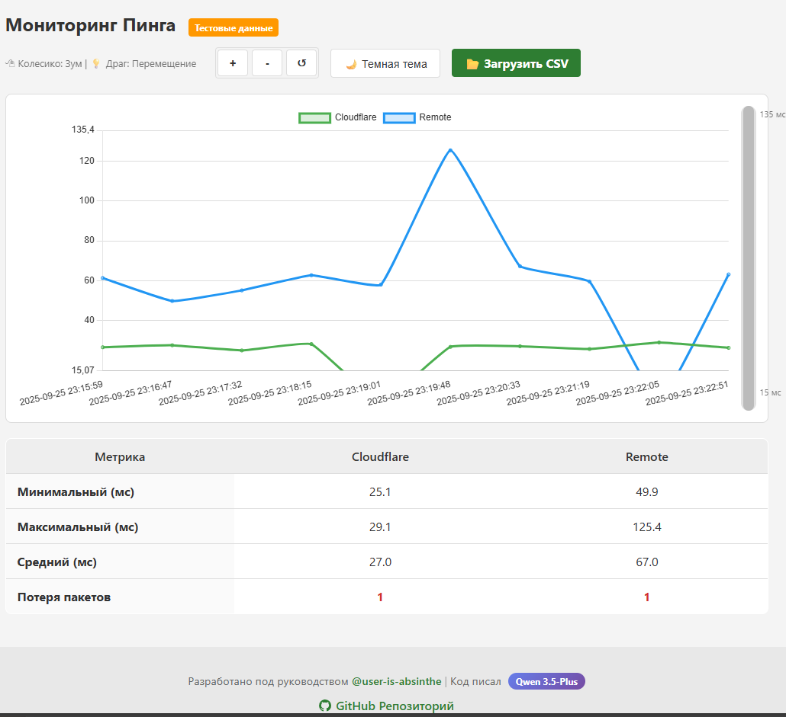
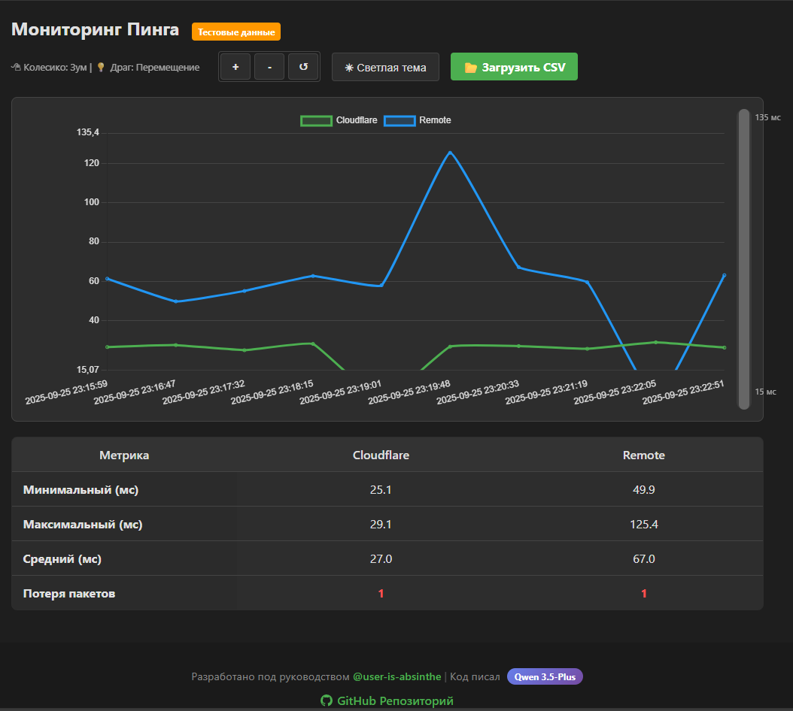

# 📊 Ping Analyzer

Веб-приложение для визуализации и анализа данных пинга из CSV-файлов.


## ✨ Возможности

- 📈 **Интерактивный график** — отображение пинга до двух серверов одновременно
- 🔍 **Масштабирование** — зум колесиком мыши, перетаскивание, кнопки +/-
- 📉 **Вертикальный скроллбар** — удобная навигация по диапазону значений
- 📋 **Статистика** — мин/макс/средний пинг и потеря пакетов для каждого сервера
- 🎨 **Две темы** — тёмная (по умолчанию) и светлая
- 📁 **Загрузка CSV** — поддержка формата с разделителем `;`
- 🧪 **Тестовые данные** — демонстрационный набор из 10 записей при старте
- 🖥 **Bash-скрипт** — автоматический сбор пинга в CSV-файл

## 🚀 Быстрый старт

### Вариант 1: Открыть локально

1. Скачайте файл `index.html`
2. Откройте его в любом современном браузере

```bash
# Просто откройте файл двойным кликом или через:
open index.html        # macOS
start index.html       # Windows
xdg-open index.html    # Linux
```

### Вариант 2: GitHub Pages

[**Попробовать онлайн можно тут.**](https://user-is-absinthe.github.io/ping_analyzer/)

## 📡 Сбор данных пинга

Для автоматического сбора данных пинга используйте встроенный bash-скрипт `ping_monitor.sh`.

### Установка и запуск

1. **Сделайте скрипт исполняемым:**
```bash
chmod +x ping_monitor.sh
```

2. **Запустите скрипт:**
```bash
./ping_monitor.sh
```

3. **Для непрерывного мониторинга** добавьте в crontab (каждую минуту):
```bash
crontab -e
# Добавьте строку:
* * * * * /path/to/ping_monitor.sh
```

### Настройка скрипта

Откройте `ping_monitor.sh` и измените параметры при необходимости:

```bash
UNREACHABLE="-1"           # Значение при потере пакета
REMOTE_SERVER="9.9.9.9"    # Удалённый сервер для проверки
OUTPUT_FILE="/home/ping_report.csv"  # Путь к CSV-файлу
```

### Требования

- **ОС**: Linux / macOS (требуется bash)
- **Утилиты**: `ping`, `grep`, `date` (обычно предустановлены)
- **Права**: доступ к сети для ICMP-запросов

### Результат работы

Скрипт создаёт CSV-файл со следующей структурой:

```csv
date_time;ping_cloudflare;ping_remote
2025-09-25 23:15:59;26.7;61.4
2025-09-25 23:16:47;27.7;49.9
```

После накопления данных — загрузите файл в веб-интерфейс через кнопку **📂 Загрузить CSV**.

---

## 📋 Формат CSV-файла

Если вы используете свой скрипт для сбора данных, файл должен соответствовать формату:

| Поле | Тип | Описание |
|------|-----|----------|
| `date_time` | string | Дата и время в формате `YYYY-MM-DD HH:MM:SS` |
| `ping_cloudflare` | float | Пинг до Cloudflare (мс). `-1` = потеря пакета |
| `ping_remote` | float | Пинг до удалённого сервера (мс). `-1` = потеря пакета |

- **Разделитель**: точка с запятой (`;`)
- **Кодировка**: UTF-8
- **Заголовок**: обязательна первая строка с названиями колонок

## 🎮 Управление

| Действие | Способ |
|----------|--------|
| Приблизить график (Y) | Кнопка `+` или колесико мыши (вперёд) |
| Отдалить график (Y) | Кнопка `-` или колесико мыши (назад) |
| Сбросить масштаб | Кнопка `↺` |
| Перемещение по графику | Перетаскивание мышью (drag) |
| Вертикальная прокрутка | Перетаскивание ползунка справа от графика |
| Сменить тему | Кнопка `☀/🌙` в верхней панели |

## 🛠 Технологии

| Компонент | Технология |
|-----------|------------|
| Графики | Chart.js |
| Жесты | Hammer.js |
| Зум | chartjs-plugin-zoom |
| Стилизация | HTML5/CSS3 |
| Логика | Vanilla JavaScript |
| Сбор данных | Bash script |

## 📁 Структура проекта

```
ping_analyzer/
├── index.html          # Основной файл приложения
├── README.md           # Этот файл
├── ping_monitor.sh     # Скрипт сбора пинга
├── .gitignore          # Файлы для исключения из git
└── screenshots/        # Скриншоты интерфейса
    ├── dark.png
    └── light.png
```

## 🔧 Локальная разработка

1. **Клонируйте репозиторий:**
```bash
git clone https://github.com/user-is-absinthe/ping_analyzer.git
cd ping_analyzer
```

2. **Откройте `index.html` в браузере**

3. **Для разработки с автообновлением** используйте локальный сервер:
```bash
# Python 3
python -m http.server 8000

# Node.js (требуется http-server)
npx http-server
```

## 📸 Скриншоты

| Светлая тема | Тёмная тема |
|--------------|-------------|
|  |  |

## 🤝 Вклад в проект

Проект создан в учебных целях. Если вы нашли ошибку или хотите предложить улучшение — создайте Issue или Pull Request.

## 📄 Лицензия

MIT License — свободное использование с указанием авторства.

## 👥 Авторы

- **@user-is-absinthe** — руководство и разработка
- **Qwen 3.5-Plus** — AI-ассистент при разработке

## 🔗 Ссылки

- [GitHub Репозиторий](https://github.com/user-is-absinthe/ping_analyzer)
- [Профиль разработчика](https://github.com/user-is-absinthe)
- [Qwen AI](https://chat.qwen.ai/)

---

<div align="center">

**Ping Analyzer** © 2025 | Сделано с ❤️ для анализа сетевых задержек

</div>
